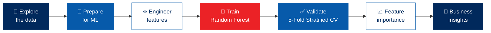
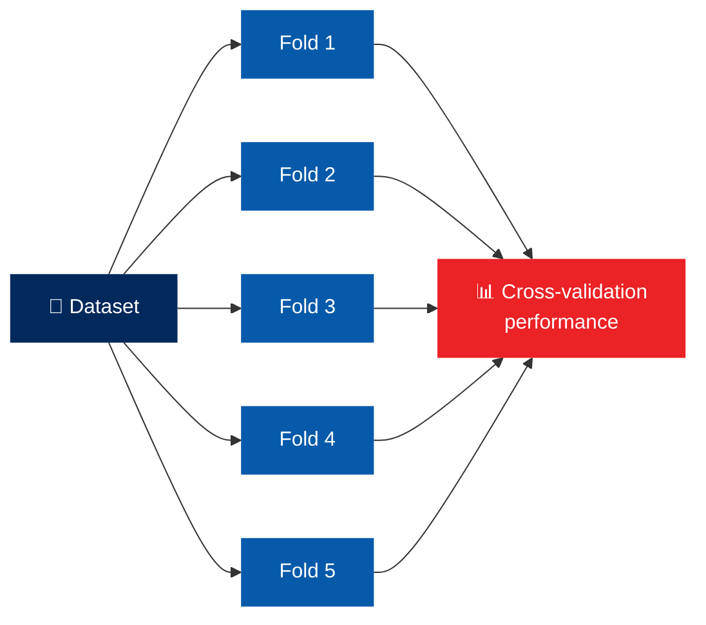
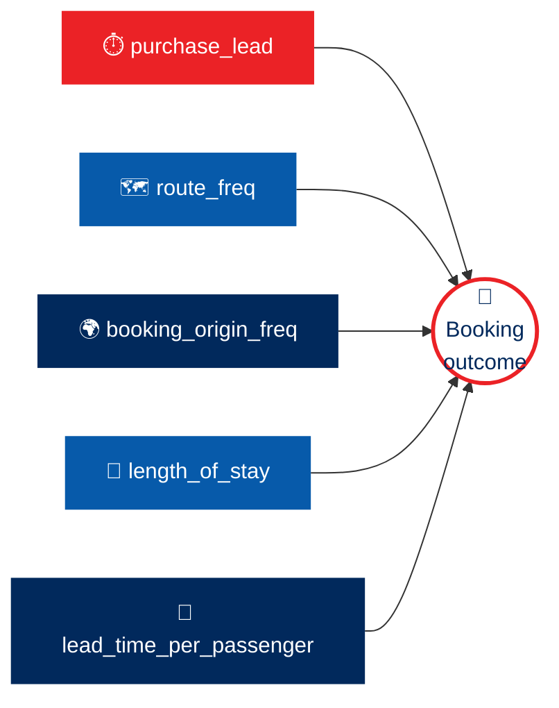

<!-- ═══════════════════════ HEADER ═══════════════════════ -->
<div align="center">


<br/>

<!-- Animated flight path (file: assets/flight-path.svg) -->


<br/><br/>


<br/><br/>

<!-- ═══════════════════════ NAVIGATION ═══════════════════════ -->
<a href="#overview"></a>
<a href="#problem"></a>
<a href="#data"></a>
<a href="#model"></a>
<a href="#insights"></a>
<a href="#run"></a>

</div>


<!-- ═══════════════════════ OVERVIEW ═══════════════════════ -->
<a id="overview"></a>

## 📌 Project Overview

This repository contains my work from the **British Airways Data Science Job Simulation**, completed through the **Forage** platform.

The project uses customer booking data to understand booking behaviour and to build a machine learning model that predicts **whether a customer is likely to complete a flight booking**.

The simulation gave me practical experience in **data exploration, feature engineering, machine learning, model validation, feature importance analysis, and communicating data-driven insights in a business context**.




<!-- ═══════════════════════ BUSINESS PROBLEM ═══════════════════════ -->
<a id="problem"></a>

## 🎯 Business Problem

Airlines need to identify potential customers **before they arrive at the airport**, rather than relying on last-minute purchasing decisions.

The objective of this project was to use historical customer booking data to:

- 🔍 Explore and understand customer booking behaviour
- 🧹 Prepare the dataset for machine learning
- ⚙️ Engineer relevant features that could improve model performance
- 🤖 Build a predictive classification model
- ✅ Evaluate the model using cross-validation and appropriate metrics
- 📈 Identify the variables that contributed most to the model's predictions
- 🎤 Communicate the findings through a business-focused presentation

> 🎯 **Target variable:** whether a customer completed a booking.


<!-- ═══════════════════════ DATA ═══════════════════════ -->
<a id="data"></a>

## 📊 Dataset

The project uses a **customer booking dataset** with information about customers' flight searches and booking behaviour.

<div align="center">

| ⏱️ **Timing** | 🗺️ **Route & Origin** | 🧳 **Trip** | 👥 **Booking** |
|:---:|:---:|:---:|:---:|
| Purchase lead time | Flight and route information | Length of stay | Number of passengers |
| | Booking origin | Trip characteristics | Booking-related behaviour |
| | | | **Booking outcome** |

</div>

The initial analysis looked at the dataset structure, data types, distributions and relevant statistics before the data was prepared for modelling.

## 🔎 Data Exploration & Preparation

<details open>
<summary><b>🧹 What the preparation process included</b></summary>
<br/>

- 🔬 Inspecting the dataset and understanding the available variables
- 🧾 Checking data types and dataset structure
- 📊 Examining the target variable and class distribution
- 🎛️ Identifying relevant numerical and categorical features
- 🛠️ Preparing variables for machine learning
- ✨ Creating additional features to represent useful customer and booking behaviour

</details>

### ⚙️ Feature Engineering

Additional features were created to give the model more informative representations of the data, while **keeping the original customer booking information**.

<div align="center">

| 🧩 Engineered Feature | 💬 What it represents |
|:---|:---|
| **`route_freq`** | The frequency of a particular route |
| **`booking_origin_freq`** | The frequency of bookings from a particular origin |
| **`lead_time_per_passenger`** | Purchase lead time combined with passenger count, showing planning behaviour relative to group size |

</div>


<!-- ═══════════════════════ MODEL ═══════════════════════ -->
<a id="model"></a>

## 🤖 Machine Learning Model

### 🌲 Random Forest Classifier

A **Random Forest Classifier** was selected for the predictive modelling task. It is suitable for this kind of tabular classification problem because it can:

<div align="center">

| 🔀 Non-linear | 🤝 Interactions | 🧮 Mixed variables | 📏 Importance | 🌳 Stability |
|:---:|:---:|:---:|:---:|:---:|
| Capture non-linear relationships | Handle interactions between features | Work well with a mixture of predictive variables | Provide feature importance measurements | Reduce reliance on a single decision tree |

</div>

The model was trained to predict the customer's booking outcome.

### ⚖️ Class Imbalance

The target variable has an imbalance between the booking classes. To handle this during training, **balanced class weights** were used so the model gives greater consideration to the minority class.


## 🧪 Model Validation

To check whether the model generalizes across different subsets of the data, **5-Fold Stratified Cross-Validation** was used. Stratification keeps a similar distribution of the target classes in each fold.

Validation was used to assess how **consistent** the model's performance is, rather than relying on a single train-test split.



### 📏 Evaluation metrics

These metrics give a broader view of the model's predictive performance, especially when the target classes are imbalanced.

<div align="center">


</div>


<!-- ═══════════════════════ INSIGHTS ═══════════════════════ -->
<a id="insights"></a>

## 📈 Feature Importance & Business Insights

Feature importance was analysed to understand which variables contributed most strongly to the Random Forest model's predictions.



<table>
<tr>
<td width="50%" valign="top">

### 1️⃣ ⏱️ Purchase Lead Time
`purchase_lead`

One of the **strongest predictive variables** in the model. It shows the time between the customer's booking activity and the planned flight, which gives useful information about booking behaviour.

</td>
<td width="50%" valign="top">

### 2️⃣ 🗺️ Route Frequency
`route_freq`

Contributed to the model's predictive ability by representing how often a particular route appeared in the dataset.

</td>
</tr>
<tr>
<td width="50%" valign="top">

### 3️⃣ 🌍 Booking Origin Frequency
`booking_origin_freq`

Captured how often bookings came from a particular origin, adding information about customer booking patterns.

</td>
<td width="50%" valign="top">

### 4️⃣ 🧳 Length of Stay
`length_of_stay`

Helped the model tell apart different booking behaviours and travel patterns.

</td>
</tr>
<tr>
<td colspan="2" valign="top">

### 5️⃣ 👥 Lead Time per Passenger
`lead_time_per_passenger`

This engineered feature gave an extra view of planning behaviour relative to the number of passengers in the booking.

</td>
</tr>
</table>

> [!NOTE]
> Feature importance shows how useful a variable was to the trained model's predictions. It does **not** establish that the variable directly causes a customer to make a booking.

## 💼 Business Interpretation

The model shows how historical customer booking data can be used to find patterns linked to booking outcomes. The feature importance analysis helps a business see which customer and booking characteristics are most useful for predictive modelling.

These insights can support **more proactive customer engagement**, by helping identify customers who may be more likely to complete a booking.

> [!IMPORTANT]
> Model predictions should be evaluated alongside business considerations and additional customer information before being used in a real-world decision-making system.


<!-- ═══════════════════════ TOOLS ═══════════════════════ -->
## 🛠️ Technologies & Tools

<div align="center">

<table align="center"><tr>
<td align="center" width="100"><br/><sub><b>Python 3.13</b></sub></td>
<td align="center" width="100"><picture><source media="(prefers-color-scheme: dark)" srcset="https://cdn.simpleicons.org/pandas/ffffff"></picture><br/><sub><b>Pandas</b></sub></td>
<td align="center" width="100"><br/><sub><b>NumPy</b></sub></td>
<td align="center" width="100"><br/><sub><b>Scikit-learn</b></sub></td>
<td align="center" width="100"><br/><sub><b>Matplotlib</b></sub></td>
<td align="center" width="100"><br/><sub><b>Seaborn</b></sub></td>
<td align="center" width="100"><br/><sub><b>Jupyter</b></sub></td>
<td align="center" width="100"><br/><sub><b>VS Code</b></sub></td>
<td align="center" width="100"><picture><source media="(prefers-color-scheme: dark)" srcset="https://cdn.simpleicons.org/github/ffffff"></picture><br/><sub><b>Git & GitHub</b></sub></td>
</tr></table>

</div>

| Tool | Used for |
|:---|:---|
| 🐍 **Pandas** | Data manipulation and analysis |
| 🔢 **NumPy** | Numerical computing |
| 🤖 **Scikit-learn** | Machine learning and model evaluation |
| 📊 **Matplotlib** | Data visualization |
| 🎨 **Seaborn** | Statistical visualization |

## 📂 Project Structure

```text
British-Airways---Data-Science-Job-Simulation/
│
├── task1.py
├── task2.py
├── requirements.txt
├── README.md
│
└── ...
```

> The project structure may vary depending on the files included in the repository.


<!-- ═══════════════════════ HOW TO RUN ═══════════════════════ -->
<a id="run"></a>

## 🚀 How to Run the Project

**1️⃣ Clone the repository**

```bash
git clone https://github.com/paraskosambe-web/British-Airways---Data-Science-Job-Simulation.git
```

**2️⃣ Navigate to the project directory**

```bash
cd British-Airways---Data-Science-Job-Simulation
```

**3️⃣ Install dependencies**

```bash
pip install -r requirements.txt
```

**4️⃣ Run the analysis**

Open the project files in **Visual Studio Code** or **Jupyter Notebook** and execute the analysis. The project performs the required data preparation, feature engineering, model training, validation and visualization steps.


<!-- ═══════════════════════ DELIVERABLES ═══════════════════════ -->
## 📋 Project Deliverables

The simulation resulted in these key deliverables:

- [x] Exploratory analysis of the customer booking dataset
- [x] Prepared dataset for machine learning
- [x] Engineered predictive features
- [x] Random Forest classification model
- [x] Cross-validation and model evaluation
- [x] Feature importance analysis
- [x] Visualizations of model results
- [x] Business-focused summary of findings

## 🎓 Skills Demonstrated

<div align="center">


<br/>


</div>

## 🏢 About the Simulation

This project was completed as part of the **British Airways Data Science Job Simulation on Forage**. The simulation was a chance to work through a realistic data science workflow, from preparing customer booking data to building and evaluating a predictive machine learning model and communicating the results in a business context.


<!-- ═══════════════════════ REPOSITORY ═══════════════════════ -->
## 🔗 Repository

<div align="center">

<a href="https://github.com/paraskosambe-web/British-Airways---Data-Science-Job-Simulation"></a>


<br/><br/>

**Paras Kosambe** • B.Sc. Computer Science Student • Aspiring Data Scientist

<a href="https://github.com/paraskosambe-web"></a>
<a href="https://www.linkedin.com/in/paras-kosambe"></a>
<a href="mailto:paraskosambe@gmail.com"></a>

<br/><br/>


</div>


