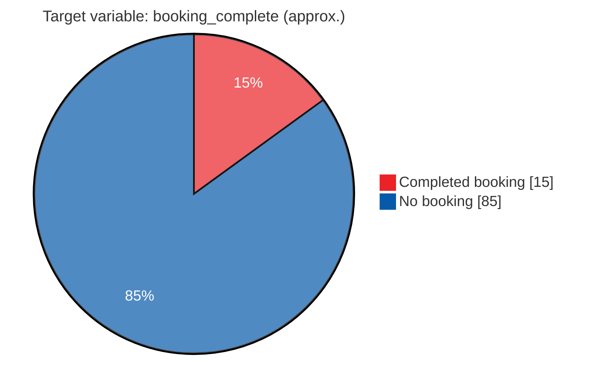
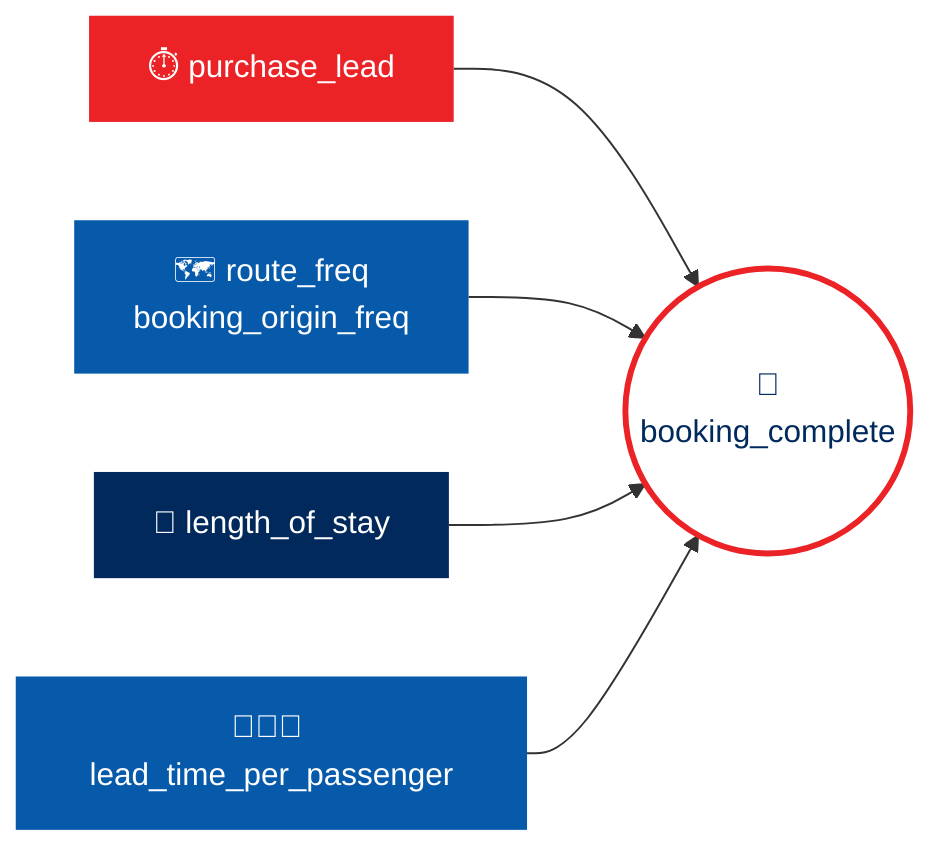

<!-- ═══════════════════════ HEADER ═══════════════════════ -->
<div align="center">


<br/>


<br/><br/>

<!-- ═══════════════════════ NAVIGATION ═══════════════════════ -->
<a href="#glance"></a>
<a href="#context"></a>
<a href="#method"></a>
<a href="#insights"></a>
<a href="#run"></a>
<a href="#deliverables"></a>

</div>


<!-- ═══════════════════════ AT A GLANCE ═══════════════════════ -->
<a id="glance"></a>

## ✈️ At a Glance

This repository contains the machine learning solution for **Task 2** of the **British Airways Data Science Job Simulation** on Forage. The goal is to build a predictive model that uncovers customer booking patterns and identifies the key factors that drive flight booking completions.

> 💡 **In one line:** *Learn from how customers behave while browsing, and predict whether each session ends in a completed booking.*

<div align="center">

| 📁 **Dataset** | 🎯 **Booking Rate** | 🌲 **Model** | ✅ **Validation** |
|:---:|:---:|:---:|:---:|
| **50,000**<br/>customer booking sessions | **~15%**<br/>complete a booking | **Random Forest**<br/>Classifier | **5-Fold**<br/>Stratified Cross-Validation |

</div>


<!-- ═══════════════════════ BUSINESS CONTEXT ═══════════════════════ -->
<a id="context"></a>

## 📌 Business Context & Objective

British Airways wants to **increase conversion rates** across its direct booking channels. When customers browse flight schedules, choose travel add-ons or select routes, their digital behavior gives strong signals about whether they will complete a reservation.

<table>
<tr>
<td width="33%" valign="top">

### 🎯 1. Predictive Analytics
Build a **binary classification model** that predicts whether a customer session ends in a completed booking (`booking_complete`).

</td>
<td width="33%" valign="top">

### 🔍 2. Commercial Insights
Uncover the main **behavioral drivers and preferences**, such as lead times, extra services and trip duration, that influence purchase decisions.

</td>
<td width="34%" valign="top">

### 🧭 3. Strategic Recommendations
Turn model insights into **actionable strategies** for marketing, pricing and product design teams to lift overall booking conversions.

</td>
</tr>
</table>


<!-- ═══════════════════════ METHODOLOGY ═══════════════════════ -->
<a id="method"></a>

## 🛠️ Methodological Approach


<details open>
<summary><b>🧹 1. Data Cleaning & Exploratory Data Analysis (EDA)</b></summary>
<br/>

- **Data integrity and consistency:** inspected the quality of all 50,000 records, checked for missing values, made variable encoding consistent, and converted text categories into numbers.
- **Class imbalance:** analyzed the target variable and found a natural imbalance of about **15% completed bookings** versus **85% non-completions**.



</details>

<details open>
<summary><b>⚙️ 2. Feature Engineering</b></summary>
<br/>

Domain-specific features were created to capture more detailed customer behavior:

| 🧩 Feature group | What it captures |
|:---|:---|
| ⏱️ **Planning & timing indicators** | Customer lead-time ratios and group-booking dynamics |
| 📈 **Aggregated demand metrics** | Historical route frequencies and origin-market demand, to give context to high-volume customer segments |
| 🧳 **Service bundling** | Combinations of add-ons (extra baggage, preferred seat, in-flight meals) to gauge purchase intent |

</details>

<details open>
<summary><b>🌲 3. Model Building & Validation</b></summary>
<br/>

- **Algorithm:** a **Random Forest Classifier**, chosen for its strength with non-linear customer behavior, feature interactions and tabular data.
- **Validation:** **5-Fold Stratified Cross-Validation**, so the model generalizes well across imbalanced splits without overfitting.
- **Balanced class weights:** decision-tree weighting was adjusted during training to handle the imbalance without losing reliability on successful bookings.

</details>


<!-- ═══════════════════════ INSIGHTS ═══════════════════════ -->
<a id="insights"></a>

## 💡 Key Business Drivers & Strategic Insights

Feature importance analysis highlighted **four main levers** that decide whether a customer completes a booking.



<table>
<tr>
<td width="50%" valign="top">

### 1️⃣ ⏱️ Purchase Lead Time
`purchase_lead`

How far in advance a customer books is the **single strongest indicator** of purchase intent. Customers who book far ahead behave very differently from last-minute browsers.

</td>
<td width="50%" valign="top">

### 2️⃣ 🗺️ Route & Origin Demand
`route_freq` • `booking_origin_freq`

Market location and route volume strongly affect how quickly customers convert. High-density origin markets reflect strong organic demand.

</td>
</tr>
<tr>
<td width="50%" valign="top">

### 3️⃣ 🧳 Trip Duration
`length_of_stay`

Length of stay correlates strongly with conversion. Long-haul and holiday trips involve different decision windows than short trips.

</td>
<td width="50%" valign="top">

### 4️⃣ 👨‍👩‍👧 Group Lead Dynamics
`lead_time_per_passenger`

Planning timelines change with party size, separating solo business travelers from family holiday bookings.

</td>
</tr>
</table>

<div align="center">

**📊 Feature importance**


</div>


<!-- ═══════════════════════ STRUCTURE ═══════════════════════ -->
## 📂 Repository Structure

```text
british-airways-data-science/
├── data/
│   └── customer_booking.csv                   # Raw dataset: 50,000 customer booking sessions
├── notebooks/
│   └── customer_booking_prediction.ipynb      # Cleaning, EDA and modeling, end to end
├── visuals/
│   └── feature_importance.png                 # Relative feature importance drivers
├── deliverables/
│   └── British_Airways_Task2_Executive_Summary.pptx   # Non-technical stakeholder presentation
├── requirements.txt                           # Python dependencies
└── README.md                                  # Overview and documentation
```


<!-- ═══════════════════════ TECH STACK ═══════════════════════ -->
## 🧰 Tech Stack & Environment

<div align="center">

<table align="center"><tr>
<td align="center" width="100"><br/><sub><b>Python 3.13</b></sub></td>
<td align="center" width="100"><picture><source media="(prefers-color-scheme: dark)" srcset="https://cdn.simpleicons.org/pandas/ffffff"></picture><br/><sub><b>Pandas</b></sub></td>
<td align="center" width="100"><br/><sub><b>NumPy</b></sub></td>
<td align="center" width="100"><br/><sub><b>Scikit-Learn</b></sub></td>
<td align="center" width="100"><br/><sub><b>Matplotlib</b></sub></td>
<td align="center" width="100"><br/><sub><b>Seaborn</b></sub></td>
<td align="center" width="100"><br/><sub><b>Jupyter</b></sub></td>
<td align="center" width="100"><br/><sub><b>VS Code</b></sub></td>
</tr></table>

</div>

| Purpose | Tools |
|:---|:---|
| 🐍 **Language** | Python 3.13 |
| 🧮 **Data analysis & processing** | `pandas`, `numpy` |
| 🤖 **Machine learning & evaluation** | `scikit-learn` |
| 📊 **Visualization** | `matplotlib`, `seaborn` |
| 💻 **Environment** | Visual Studio Code / Jupyter Notebooks |


<!-- ═══════════════════════ HOW TO RUN ═══════════════════════ -->
<a id="run"></a>

## 🚀 How to Run the Project

**1️⃣ Clone the repository**

```bash
git clone https://github.com/paraskosambe-web/British-Airways---Data-Science-Job-Simulation.git
cd British-Airways---Data-Science-Job-Simulation
```

**2️⃣ Install the dependencies**

```bash
pip install -r requirements.txt
```

**3️⃣ Run the analysis**

Launch **VS Code** or **Jupyter Lab**, open the notebook below, and **run all cells**. This performs the data processing, trains the Random Forest model and generates the visual outputs.

```text
notebooks/customer_booking_prediction.ipynb
```


<!-- ═══════════════════════ DELIVERABLES ═══════════════════════ -->
<a id="deliverables"></a>

## 📋 Project Deliverables

<div align="center">

| 📦 Deliverable | What it is |
|:---|:---|
| 📓 **[Jupyter Notebook](./notebooks/customer_booking_prediction.ipynb)** | End-to-end data cleaning, EDA, feature engineering and modeling |
| 📊 **[Feature Importance Chart](./visuals/feature_importance.png)** | Visual of the key drivers behind booking completions |
| 🎤 **[Executive Summary (PPTX)](./deliverables/British_Airways_Task2_Executive_Summary.pptx)** | Non-technical presentation for stakeholders |

<br/>

<a href="./notebooks/customer_booking_prediction.ipynb"></a>
<a href="./deliverables/British_Airways_Task2_Executive_Summary.pptx"></a>

</div>


<!-- ═══════════════════════ AUTHOR ═══════════════════════ -->
## 👨‍💻 Author

<div align="center">

### Paras Kosambe
**B.Sc. Computer Science Student** • Aspiring Data Scientist • AI/ML • Python • SQL

<br/>

<a href="https://github.com/paraskosambe-web"></a>
<a href="https://www.linkedin.com/in/paras-kosambe"></a>
<a href="mailto:paraskosambe@gmail.com"></a>

<br/><br/>

<sub>This project was completed as part of a Forage job simulation for educational purposes. It is not affiliated with or endorsed by British Airways.</sub>

<br/><br/>


</div>


